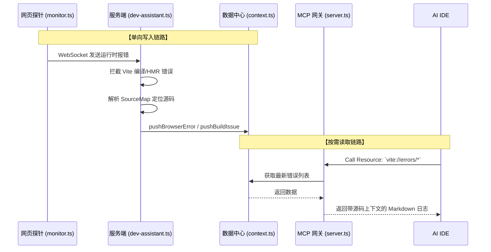

# Vite-Plugin-Copilot-Dev 架构设计

## 🎯 核心定位 (The Goal)

本项目是一个连接 Vite/浏览器 与 AI IDE (如 Cursor, Cline) 的 **双向桥梁 (Bridge)**。
旨在将原本对 AI 隐藏的**浏览器运行时环境**和 **Vite 构建内部状态** 暴露给 AI，从而实现自动化的智能诊断与控制。

## 🏛️ 模块划分 (Architecture)

项目严格解耦为 4 个核心模块。各自职责分明，互不越界：

### 1. 浏览器探针 (Browser Probe)

- **位置**: `src/client/` (核心: `monitor.ts`)
- **运行环境**: 浏览器客户端
- **职责**:
  - 拦截 `window.onerror`, `console.error/warn`, `unhandledrejection`。
  - 劫持 `fetch` / `XMLHttpRequest` 捕获网络失败。
  - 纯粹进行端侧错误收集，通过 WebSocket (`copilot:browser-error`) 向服务端上报原始日志。

### 2. 服务端数据处理 (Server Assistant)

- **位置**: `src/server/` (核心: `dev-assistant.ts`)
- **运行环境**: Node.js (Vite Dev Server 钩子中)
- **职责**:
  - 接收客户端传来的报错，利用 Vite ModuleGraph / SourceMap 将打包后的乱码堆栈映射回**真实的本地源码行**。
  - 拦截 Vite 本身的 `server.ws.send`，主动捕获 HMR (热更新) 错误和语法编译报错。
  - 降噪、脱敏后，将结构化数据写入全局数据中心 (`Context`)。

### 3. 全局数据中心 (State Context)

- **位置**: `src/mcp/context.ts`
- **运行环境**: Node.js 内存
- **职责**:
  - 作为唯一的 State 容器，保存当前的 `server` 实例，以及最新的 `BrowserErrors` 和 `BuildErrors` 队列。
  - 它是一道防火墙，**解耦了写入端（Vite 生命周期）和 读取端（MCP 请求）**。

### 4. MCP 网关 (AI Gateway)

- **位置**: `src/mcp/` (子目录: `resources/`, `tools/`, `prompts/`)
- **运行环境**: Node.js (作为 MCP Server)
- **职责**:
  - **Resources**: 将 `Context` 中的错误数据格式化为 Markdown 给 AI 读取（如 `vite://errors/browser`）。
  - **Tools**: 把对 Vite `server` 实例的操作包装成 AI 可调用的工具（如 `clear-cache`, `restart-server`）。

---

## 🔄 数据流向图 (Data Flow)

## 🛡️ 架构维护原则

1. **入口极简**: `src/index.ts` 永远只做生命周期钩子的路由和胶水层，不可在此处编写大段逻辑。
2. **环境隔离**: `src/client/` 里的代码严禁出现 `fs`, `path` 等 Node API；`src/mcp/` 和 `src/server/` 中的逻辑绝对不可被打包到浏览器中。
3. **单向依赖**: `dev-assistant` 可以依赖 `context`，`mcp` 也可以依赖 `context`，但 `mcp` 不应直接去调用 `dev-assistant` 的方法。一切状态流转通过 `context.ts` 完成。
